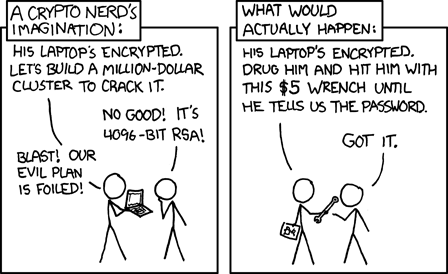

# ColdCard Setup and Backup Guide
### Requirements
* ColdCard
* micro usb cable and power adapter
* 2x micro SD card (`SD card A` and `SD Card B`)
* card reader
* casino dice
* pencil
* computer
* Print out all three [coldcard backup recovery cards](https://coldcardwallet.com/docs/recovery-cards)
    1. [coldcard backup card](https://coldcardwallet.com/docs/static/pdf/coldcard-backup-card-v2.png)
    1. [passphrase backup card](https://coldcardwallet.com/docs/static/pdf/recovery-card-v1.png)
    1. [microSD backup card](https://coldcardwallet.com/docs/static/pdf/microsd-password-v1.png)
    
### Receive ColdCard
How to buy ColdCard
1. Best way to buy is in person at a conference or at a local meetup from a trusted source
1. Second best is to buy from [official coldcard shop](https://coldcardwallet.com/)
1. Ship it to an address that is `not your home`, using a `burner email` and a `burner phone number`, and `bitcoin for payment.`

### ColdCard first time use check
Follow more detailed [official guide](https://coldcardwallet.com/docs/quick)

1. Check bag for tamper
1. Check device for tamper
1. Power up ColdCard using micro usb cable and power adapter

### Set ColdCard PIN number
1. Set initial PIN code
1. Write down PIN code to [coldcard backup card](https://coldcardwallet.com/docs/static/pdf/coldcard-backup-card-v2.png)
1. Write down 2 anti-phishing words to [coldcard backup card](https://coldcardwallet.com/docs/static/pdf/coldcard-backup-card-v2.png)

### Change ColdCard PIN number if needed
1. Select `Settings > PIN Options > Change Main PIN`.
2. Enter old Main PIN
3. Enter new Main PIN
4. Write down PIN code to [coldcard backup card](https://coldcardwallet.com/docs/static/pdf/coldcard-backup-card-v2.png)
5. Write down 2 anti-phishing words to [coldcard backup card](https://coldcardwallet.com/docs/static/pdf/coldcard-backup-card-v2.png)

### Upgrade ColdCard firmware
Watch [how to upgrade firmware video](https://www.youtube.com/watch?v=RYcB5HpfcaE&list=PLZKkuPrgFw0axLoDDzxAIYzpZeC_T1i7W&index=3)

On computer:
1. Download the [latest firmware release](https://coldcardwallet.com/docs/upgrade)
1. Verify coldcard's firmware:
    1. Import the coldcard signing key (you can skip this part if you have already imported signing key on your computer before):

       `curl https://keyserver.ubuntu.com/pks/lookup?op=get&search=0xA3A31BAD5A2A5B10 | gpg --import`

       The signing key downloaded should be: `4589779ADFC14F3327534EA8A3A31BAD5A2A5B10`
    1. Download [signatures.txt](https://github.com/Coldcard/firmware/blob/master/releases/signatures.txt) from github
    1. Verify the signature: gpg --verify signatures.txt
    1. Calculate the hash of the firmware file: `shasum -a 256 20...coldcard.dfu`
    1. Confirm it is the same hash as the one shown inside [signatures.txt](https://raw.githubusercontent.com/Coldcard/firmware/master/releases/signatures.txt)

1. Save the `2021...-coldcard.dfu` firmware file onto a `SD card A`.

On ColdCard:
1. Insert `SD card A` into ColdCard
1. Power up your ColdCard and unlock it with your PIN.
1. Select `Advanced > Upgrade > From MicroSD`.
1. After the confirmation dialog, ColdCard will upgrade and reboot (slow).
1. Type in your PIN again. Verify new version running with: `Advanced > Upgrade > Show Version`
1. If you powered down during this process, to get a green light again, you may need to use: Bless Firmware in that menu.

### Create new wallet seed
Generate 24-word wallet seed with ColdCard and 99 dice rolls. You can [verify dice roll math](https://coldcardwallet.com/docs/verifying-dice-roll-math) to check that ColdCard's random number generator (RNG) is not compromised.

1. Select `New Wallet` and `press 4` to add 99 dice rolls. This will add entropy to the seed generation process.
2. Write down 24-word seed on the [coldcard backup card](https://coldcardwallet.com/docs/static/pdf/coldcard-backup-card-v2.png)
3. Verify that the 24-words on the [coldcard backup card](https://coldcardwallet.com/docs/static/pdf/coldcard-backup-card-v2.png) match to the 24-words on ColdCard
4. Select `Advanced > View Identity` and write down Master Key Fingerprint on the [coldcard backup card](https://coldcardwallet.com/docs/static/pdf/coldcard-backup-card-v2.png)

### Reset and create new wallet seed if needed
`WARNING!!!` This action will cause you to loose all your funds associated with this wallet. Make sure you have written down 24-word seed on the `coldcard backup card` just in case.

1. Select `Advanced > Danger Zone > Seed Functions > Destroy Seed`.
2. Read the notification text carefully and confirm
3. [Create new wallet seed](create-new-wallet-seed)

### Backup digital wallet file on SD card
Create digital backup file of the 24-word wallet seed on your `SD card A`. The file is encrypted and protected by the 12-word seed.

1. Insert `SD card A` to a ColdCard
1. Select `Advanced > Backup > Backup System > Press OK`
1. ColdCard gives you a 12-word seed for your digital wallet backup file. Write down 12 backup file words on [microSD backup card](https://coldcardwallet.com/docs/static/pdf/microsd-password-v1.png)

### Create new passphrase wallet
You may add a [BIP39 passphrase](https://coldcardwallet.com/docs/passphrase) to your 24-word wallet seed. This creates entirely new wallet, for every possible passphrase. The Coldcard never stores your passphrase. You must re-enter it each time you use the wallet.
1. Create and write down your passphrase:
    1. We suggest making a six-word passphrase. Check [BIP39-diceware](https://github.com/dstodolny/BIP39-diceware) for more info.
    1. Flip the coin (H-Heads | T-Tails) and roll the dice four times (dice number 1-6).
    1. Your results might look like this reading left to right: H,3,4,6,3.
    1. Open [dice wordlist](https://github.com/dstodolny/BIP39-diceware/blob/master/words) to find the corresponding word next to H3463
    1. Write down corresponding word on `passphrase backup card`
    1. Repeat steps five more times to come up with a total of SIX words
1. On ColdCard select `Passphrase`
1. Create new passphrase and add 6 words by selecting `Add Word`
1. After sixth word was added, select `APPLY`
1. Write down fingerprint on the [passphrase backup card](https://coldcardwallet.com/docs/static/pdf/recovery-card-v1.png)
1. Verify that the passphrase words on the [passphrase backup card](https://coldcardwallet.com/docs/static/pdf/recovery-card-v1.png) match to the passphrase words on ColdCard
1. Insert `SD card B` to a ColdCard (`WARNING!!!` switch your SD cards from `SD card A` to `SD card B`)
1. `press 1` to copy passphrase to the `SD card B`

### Stamp 24-word wallet seed and passphrase
`WARNING!!!` Remember that anyone who gets access to your seed and passphrase together can steal all of your bitcoin, so stamp your seed and passphrase separately on two pieces of metal plate. Never enter it into your computer.

Requirements
* backup cards (coldcard backup card, passphrase backup card)
* Hammer
* Letter & Number Stamp Set. 3mm (1/8")
* Piece of stainless steel or check [metal backup plate](https://bitcoinseedbackup.com/)

### Distribute recovery seed, digital backups, passphrase to multiple locations

`WARNING!!!` Remember that anyone who gets access to your seed and passphrase together can steal all of your bitcoin, so do not store the seed and passphrase together in one place!

Some good places to store a seed:
- Vaults at banks - safe-deposit boxes have the added benefit that in the event of your death they should naturally transfer over to your heirs
- Safes at home/work - you may not have the security systems/monitoring of a bank, but you also don’t have to trust a third party to let you in (and no one will be peeking over your shoulder)
- With a trusted family member (or very close friend) - remember that if you give away seed and the passphrase, this person can spend your bitcoin

### How to prevent 5$ wrench attack

1. By signing PSBT (Partially Signed Bitcoin Transaction) with your ColdCard only inside the bank vault so that ColdCard never leaves your bank.
2. Keep it private. First rule of bitcoin club is, you don't talk about your bitcoins.
3. Prevent getting unwanted attention.